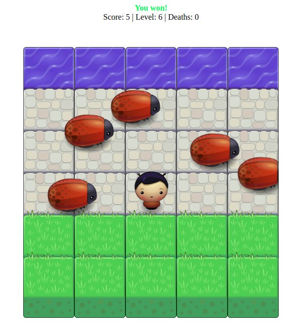

# Frogger

[Play now!](https://singhpratyush.github.io/frogger/)

### Controls

&nbsp;&nbsp;&nbsp;&nbsp;&nbsp;:arrow_up:  
:arrow_left::arrow_down::arrow_right:

## Gameplay

The gameplay is simple. You cross the path to advance levels.
With each level, the game keeps becoming more and more difficult.
Initially, up to 5 levels, the number of enemies increase and then the speed at which they move increases.

## How to run the game?

Just open the [`index.html`](index.html) file in a `HTML5` enabled browser.

> The boilerplate of the game was taken from https://github.com/udacity/frontend-nanodegree-arcade-game.
